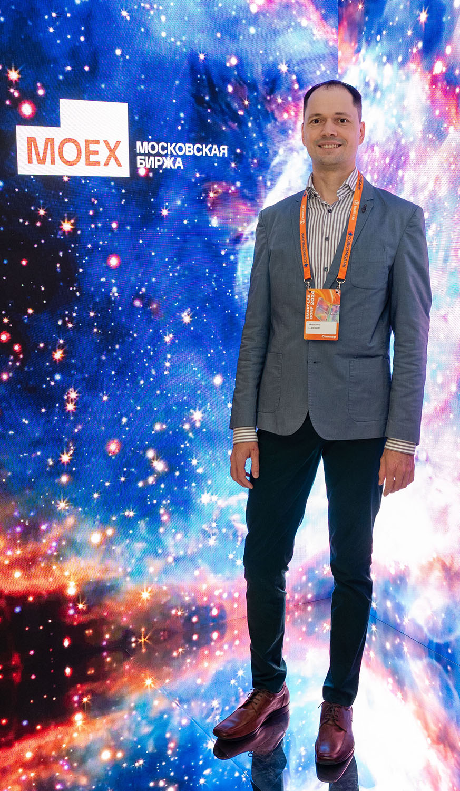

<h1 align="center">  
  
</h1>

👋 Hello there!

I'm Mikhail, a passionate advocate for efficient living through smart technology and financial savviness.  I'm actively involved in various online communities, always looking to share and learn about personal finance, investing, home automation, and DIY projects.

My focus areas include:

* **💰  Investing & Financial Independence:**  I'm fascinated by the world of finance and constantly exploring strategies for building wealth and achieving financial independence. This includes diving deep into stocks, bonds, alternative investments, and early retirement strategies (FIRE).  I enjoy sharing my findings and discussing different approaches to personal finance.

* **🏡 Smart Home & Automation:** My home is my playground! I love experimenting with DIY home automation solutions, focusing on cost-effective implementations and maximizing efficiency.  From tinkering with Home Assistant, ESPHome or others to optimizing energy usage, I'm always looking for ways to make my home smarter.

* **🛠️ DIY & Problem Solving:** I thrive on finding creative solutions to everyday challenges.  Whether it's automating tasks with scripts, building custom tools, or tackling home improvement projects, I enjoy the process of identifying problems and crafting effective solutions.  I believe in the power of continuous learning and improvement.

I'm a firm believer that technology and financial knowledge can empower us to live more fulfilling lives. I'm always eager to connect with like-minded individuals and exchange ideas.  Feel free to reach out!

---

### 🔗 Find me elsewhere

 

    
    &nbsp;&nbsp;&nbsp;
    
    &nbsp;&nbsp;&nbsp;
    
    &nbsp;&nbsp;&nbsp;

My personal website: <a href="https://shardin.name/?utm_source=github">https://shardin.name/</a> 

### :star2: GitHub Stats

  

